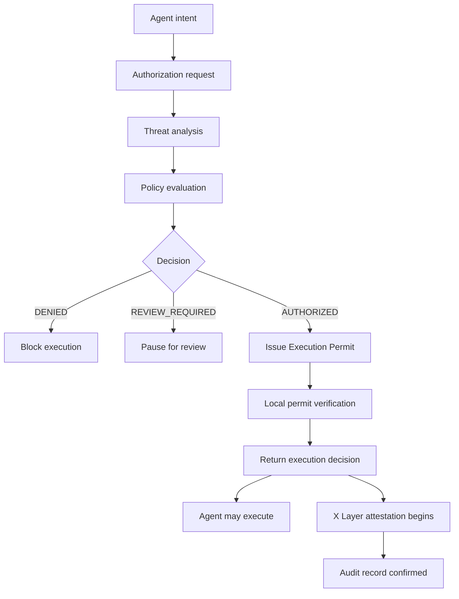
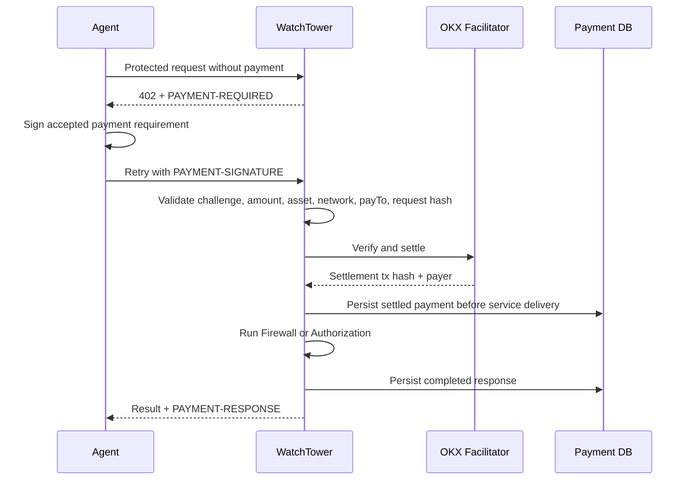

# WatchTower

## Pre-execution security for autonomous trading agents

Autonomous agents can find a market opportunity, reason about it, and submit a transaction faster than a human can inspect the token behind it. WatchTower adds a security gate before that execution step.

WatchTower gives agents two production-facing experiences:

- **Firewall**: a fast, lightweight token security check for frequent pre-trade screening.
- **Authorization**: the premium Permission to Execute flow. It runs the full threat engine, evaluates execution policy, issues a signed Execution Permit when allowed, and returns a machine-readable decision.

The core guarantee is simple:

> An autonomous agent should not execute unless WatchTower returns `AUTHORIZED` and the Execution Permit verifies successfully.

WatchTower can be used through the TypeScript SDK, REST API, MCP server, and CLI demo agent. The technical sections below cover payments, reports, attestations, and deployment; the product idea is simpler: verify first, execute second.

Built for the **X Layer Hackathon**.

## Why WatchTower?

Traditional security tools return information. WatchTower returns permission.

It is not another dashboard for humans to refresh after discovering a token. It is an execution authorization layer for autonomous agents: a service an agent calls before it signs, swaps, or routes capital. Firewall answers, "What does this token look like?" Authorization answers, "Is this agent allowed to execute this intent?"

That shift matters because autonomous agents do not naturally pause at the wallet confirmation screen. WatchTower creates that pause in software.

```ts
const result = await watchtower.authorize({
  action: "swap",
  token: "0xTokenAddress",
});

if (!result.executable || !result.authorization) {
  return;
}

await executeTrade(result.authorization);
```

### Quick Navigation

- [Why WatchTower?](#why-watchtower)
- [Product model](#product-model)
- [First Authorization request](#sdk)
- [CLI demo agent](#cli-demo-agent)
- [MCP tools](#mcp)
- [REST API](#rest-api)
- [x402 payments](#x402-payment-flow)
- [Running locally](#running-locally)
- [Deployment](#deployment)
- [Post-hackathon hardening](#post-hackathon-hardening)

---

## The Problem

AI agents are becoming active participants in onchain markets. They can monitor tokens, discover liquidity, and make trading decisions continuously. That creates a new security problem: malicious token contracts only need one automated mistake.

Humans usually pause before signing a transaction. They scan the destination, notice a warning, hesitate, or ask for another opinion. Autonomous agents do not have that instinct by default. Once their policy says "go," execution can happen immediately.

WatchTower protects that exact moment before execution.

It answers:

- Is this token safe enough for an agent to consider?
- Should this exact execution intent be allowed?
- Was the decision backed by a signed Execution Permit?
- Can operators inspect what happened later?

### Traditional Scanner vs WatchTower

| Traditional scanner | WatchTower |
| --- | --- |
| Returns information | Returns permission |
| Built for humans | Built for autonomous agents |
| Dashboard-driven | SDK, REST, and MCP native |
| Risk score | Machine-readable execution decision |
| Useful after discovery | Designed for the pre-execution path |

---

## Why Permission to Execute Matters

Threat intelligence alone is useful, but autonomous systems need a deterministic execution gate.

Authorization turns a token scan into a decision:

```text
AUTHORIZED
REVIEW_REQUIRED
DENIED
```

Only `AUTHORIZED` can produce an Execution Permit. The SDK and demo agent verify that permit before execution continues. `DENIED`, `REVIEW_REQUIRED`, missing permits, malformed permits, expired permits, signer mismatch, or signature verification failure all block execution.

The LLM never overrides WatchTower. It may explain the result, but WatchTower and the policy engine decide whether the agent may act.

---

## Product Model

| Experience | Endpoint / Tool | Price | Purpose |
| --- | --- | ---: | --- |
| **Firewall** | `POST /api/scan` / `scan_token` | 0.5 USDT | Fast risk verdict for frequent checks. |
| **Authorization** | `POST /api/authorize` / `authorize_transaction` | 1 USDT | Full threat analysis, policy evaluation, signed Execution Permit, immediate execution decision, and audit metadata. |

`POST /api/scan/deep`, SDK `deepScan()`, and MCP `deep_scan_token` remain available only as compatibility aliases for existing Marketplace and legacy integrations. New integrations should use Authorization.

---

## How WatchTower Works



Firewall follows the same threat-analysis engine but stops earlier: it returns a fast risk verdict for the agent's own policy instead of issuing an Execution Permit.

### Threat Engine

WatchTower uses live provider-backed data. It does not invent missing signals.

| Module | Source | Checks |
| --- | --- | --- |
| Liquidity Intelligence | DexScreener | Liquidity depth, pair activity, volume, age, missing markets. |
| Contract DNA | GoPlus Security | Honeypot flags, sell restrictions, ownership controls, mintability, taxes. |
| Whale Intelligence | Ethplorer | Holder concentration and top-holder exposure. |
| Social Threat Radar | DexScreener-backed market activity | Transaction skew, volatility, momentum, bot-like activity signals. |

If a module is unavailable, WatchTower marks it unavailable, excludes its weight from scoring, redistributes active module weights, and lowers confidence.

### Chain Resolution

`chainId` is a first-class input. If callers omit it, WatchTower attempts chain resolution using supported EVM networks. Ambiguous or fallback-only results are rejected before payment so users are not charged for a scan against the wrong chain.

### Policy Evaluation

Threat recommendations map into execution decisions:

| Threat Recommendation | Authorization Decision | Execution Verdict |
| --- | --- | --- |
| `TRADE` | `AUTHORIZED` | `EXECUTE` |
| `CAUTION` | `REVIEW_REQUIRED` | `REVIEW` |
| `ABORT` | `DENIED` | `ABORT` |

---

## Execution Permits

Authorization binds approval to a specific execution intent.

The permit includes:

- `agentWallet`
- `action`
- `tokenAddress`
- `chainId`
- `executionHash`
- optional `amountUsd`
- optional `recipient`
- optional `spender`
- `calldataHash`
- `riskScore`
- `issuedAt`
- `expiresAt`
- signer address
- EIP-712 domain
- signature

The canonical permit logic lives in the shared SDK permit module and is reused by the backend, SDK, MCP flow, and demo agent. Normal SDK users do not configure trust manually; the SDK pins verification to the built-in WatchTower policy by default. Advanced deployments may override the trust policy for self-hosted infrastructure.

Hash terminology:

| Hash | Meaning |
| --- | --- |
| `analysisHash` | Content hash of the threat-analysis result. Preserved as `scanHash` for compatibility. |
| `permitHash` | Hash of the signed Execution Permit. Present only when a permit is issued. |
| `reportHash` | Hash used by `/report/[reportHash]`. For authorized permits this is usually the `permitHash`; otherwise it falls back to the analysis hash. |

---

## SDK

Package name in this workspace: `okx-watchtower-middleware`.

If you are integrating WatchTower into an autonomous agent, `authorize()` is the primary API most developers need.

### Authorization

Use `authorize()` anywhere an agent needs a decision before acting.

```bash
npm install okx-watchtower-middleware
```

```ts
import {
  WatchTowerAuthorizationError,
  WatchTowerPaymentRequiredError,
  WatchTowerClient,
} from "okx-watchtower-middleware";

const wt = new WatchTowerClient({
  apiUrl: "https://watchtowr.xyz",
  agentWallet: process.env.AGENT_WALLET!,
  chainId: 196,
  paymentPrivateKey: process.env.AGENT_PAYMENT_KEY,
  paymentRpcUrl: process.env.MAINNET_RPC_URL,
  paymentPolicy: {
    apiOrigin: "https://watchtowr.xyz",
    chainId: 196,
    tokenAddress: process.env.MAINNET_USDT_ADDRESS!,
    tokenDecimals: 6,
    treasuryAddress: process.env.MAINNET_TREASURY_ADDRESS!,
    maxAmount: "1",
  },
});

try {
  const result = await wt.authorize({
    action: "swap",
    token: "0xTokenAddress",
    amountUsd: 250,
  });

  if (!result.executable || !result.authorization) {
    console.log("Execution blocked:", result.decision);
    return;
  }

  const permit = result.authorization;
  await executeTrade(permit);
} catch (error) {
  if (error instanceof WatchTowerAuthorizationError) {
    console.log("Permit verification failed:", error.message);
    return;
  }
  if (error instanceof WatchTowerPaymentRequiredError) {
    console.log("Payment signature required:", error.paymentRequired);
    return;
  }

  throw error;
}
```

When `authorize()` returns `executable: true`, the SDK has verified:

- WatchTower returned `AUTHORIZED`;
- an Execution Permit exists;
- the EIP-712 signature is valid;
- the signer matches the default WatchTower trust policy;
- the permit domain matches the canonical policy;
- the permit has not expired.

If you need to verify a permit outside `authorize()`, use the same built-in trust policy:

```ts
if (!result.authorization) {
  return;
}

const verification = await WatchTowerClient.verifyAuthorization(result.authorization);
if (!verification.authorized) {
  return;
}
```

### Automatic x402 Settlement

For server-side agent runtimes, the SDK can sign and retry paid requests automatically. The Authorization example above uses this mode. The same payment configuration also works for Firewall.

`paymentPrivateKey` must only be used in a secure server-side agent runtime. The payment policy pins origin, chain, token, treasury, and maximum amount before the SDK signs. Without automatic payment configuration, paid endpoints return `WatchTowerPaymentRequiredError` so an external wallet flow can sign the challenge and retry with `paymentSignature`.

### Firewall

Use `guardTransaction()` when the agent only needs the fast Firewall verdict.

```ts
const scan = await wt.guardTransaction("0xTokenAddress", {
  chainId: 196,
});
```

`guardTransaction()` throws `WatchTowerAbortError` when the configured threshold is exceeded.

## CLI Demo Agent

The demo agent is the product story in terminal form:

```text
Market Opportunity
→ Request Authorization
→ WatchTower Analysis
→ Policy Evaluation
→ Execution Permit Issued
→ Permit Verification
→ Execution Gate
→ Execute / Block / Review
→ Audit Trail
```

Run it:

```bash
cd demo-agent
npm install
cp .env.example .env
npm start
```

Default mode is Authorization. Legacy flags remain for comparison:

```bash
npm start -- --authorize
npm start -- --firewall
npm start -- --deep
```

`--deep` is a compatibility alias, not the recommended path for new integrations.

---

## MCP

WatchTower exposes a Streamable HTTP MCP endpoint at:

```text
POST /api/mcp
```

Example MCP config:

```json
{
  "mcpServers": {
    "watchtower": {
      "url": "https://watchtowr.xyz/api/mcp"
    }
  }
}
```

Tools:

| Tool | Purpose |
| --- | --- |
| `scan_token` | Firewall scan. |
| `authorize_transaction` | Canonical Execution Authorization flow. |
| `deep_scan_token` | Compatibility alias for existing Marketplace listings. |

Paid MCP calls use the same validation, chain-resolution, x402 settlement, replay protection, payment persistence, and service-delivery recovery logic as REST. If the underlying tool fails after payment settlement, WatchTower releases the payment processing state so the same signed request can be retried instead of finalizing a failed service response.

---

## REST API

### Firewall

```http
POST /api/scan
Content-Type: application/json
PAYMENT-SIGNATURE: <base64-encoded PaymentPayload>
```

```json
{
  "tokenAddress": "0xTokenAddress",
  "chainId": "196",
  "agentWallet": "0xAgentWallet"
}
```

Returns a fast scan result with threat score, confidence, recommendation, reasoning, module details, and `scanHash` for compatibility with existing scan integrations.

### Authorization

```http
POST /api/authorize
Content-Type: application/json
PAYMENT-SIGNATURE: <base64-encoded PaymentPayload>
```

```json
{
  "tokenAddress": "0xTokenAddress",
  "chainId": "196",
  "agentWallet": "0xAgentWallet",
  "action": "swap",
  "amountUsd": 250,
  "recipient": "0xRecipient",
  "spender": "0xSpender",
  "calldata": "0x..."
}
```

Returns:

- `decision`: `AUTHORIZED`, `REVIEW_REQUIRED`, or `DENIED`
- `verdict`: `EXECUTE`, `REVIEW`, or `ABORT`
- `authorization`: signed Execution Permit or `null`
- `verification`: server-side permit verification result when a permit is issued
- `attestation`: audit-plane lifecycle metadata. Authorized responses return `pending` immediately, then reports update to `confirmed` or `failed` when X Layer anchoring completes
- `scan`: `analysisHash`, compatibility `scanHash`, `reportHash`, optional `permitHash`, and `reportUrl`
- `report`: persisted report payload

### Compatibility

```http
POST /api/scan/deep
```

Legacy paid endpoint retained for OKX Marketplace and older SDK integrations. It runs the evolved Authorization analysis path and returns an Execution Authorization compatibility report.

SDK `deepScan()` and MCP `deep_scan_token` remain available for existing integrations. New SDK integrations should use `authorize()`, and new MCP integrations should use `authorize_transaction`.

### Other Routes

| Route | Purpose |
| --- | --- |
| `POST /api/mcp` | MCP Streamable HTTP endpoint. |
| `POST /api/scan/dashboard` | Free Network Explorer token report entry point. |
| `GET /api/telemetry` | Operational scan/payment/feed telemetry. |
| `GET /api/health` | Health and payment-network readiness. |
| `GET /report/[reportHash]` | Public report view. |
| `GET /verify` | X Layer registry transaction verification. |

---

## x402 Payment Flow

WatchTower uses x402 with the OKX facilitator for machine-to-machine payments.



Reliability properties:

- successful payment responses are not returned until settlement is durably persisted;
- settlement transaction hashes are unique;
- request hashes bind payment to endpoint, tier, method, and request body;
- verified payer identity is used for paid service attribution;
- completed paid responses are replayable on retry;
- transient `processing` states include retry guidance;
- failed service delivery releases the payment back to a recoverable settled state.

---

## Reports, Attestations, And Audit Trail

Authorization reports are persisted and available at:

```text
/report/[reportHash]
```

When an Execution Permit is issued, WatchTower computes a `permitHash` and returns authorization immediately after the permit verifies locally. X Layer anchoring runs as the audit plane: WatchTower records the permit hash through `WatchTowerRegistry` and updates the report when confirmation is available. The `/verify` page decodes a confirmed registry transaction and verifies the emitted `ScanRecorded` event.

Attestation proves that the configured WatchTower registry recorded a particular hash, token, chain, score, and timestamp. It does not prove every offchain provider response was independently recomputed by a decentralized validator set.

---

## Running Locally

### Prerequisites

- Node.js 20+
- npm
- Foundry, only for smart-contract tests
- Turso/libSQL for production-like database testing, or local SQLite for development
- X Layer RPC, accepted ERC-20 payment token, treasury, and registry signer for live paid tests

### Install

```bash
git clone https://github.com/demola13777/watchtower.git
cd watchtower
npm install
npm --prefix packages/watchtower-sdk install
npm --prefix packages/watchtower-sdk run build
cp .env.example .env.local
npm run dev
```

Local development falls back to `watchtower.db` when Turso variables are not set.

### Useful URLs

```text
http://localhost:3000
http://localhost:3000/docs
http://localhost:3000/network
http://localhost:3000/verify
```

---

## Deployment

The application is configuration-driven. Production mode should set:

```bash
NEXT_PUBLIC_NETWORK_ENV=mainnet
NEXT_PUBLIC_SITE_URL=https://watchtowr.xyz

MAINNET_RPC_URL=https://your-x-layer-rpc
MAINNET_CHAIN_ID=196
MAINNET_TREASURY_ADDRESS=0xYourTreasury
MAINNET_PAYMENT_TOKEN_SYMBOL=USDT0
MAINNET_USDT_ADDRESS=0xAcceptedToken
MAINNET_PAYMENT_TOKEN_DECIMALS=6

NEXT_PUBLIC_REGISTRY_ADDRESS=0xWatchTowerRegistry
NEXT_PUBLIC_REGISTRY_CHAIN_ID=196
NEXT_PUBLIC_REGISTRY_RPC_URL=https://your-x-layer-rpc
PRIVATE_KEY=0xRegistryWriterKey

OKX_API_KEY=...
OKX_SECRET_KEY=...
OKX_PASSPHRASE=...

TURSO_DATABASE_URL=...
TURSO_AUTH_TOKEN=...
```

Before enabling paid traffic:

1. Apply Drizzle migrations with `npm run db:push`.
2. Run `npm run validate:mainnet`.
3. Run payment canaries for Firewall and Authorization.
4. Verify `/report/[reportHash]` and `/verify`.
5. Run `npm run reconcile:payments`.
6. Review [docs/MAINNET_READINESS.md](./docs/MAINNET_READINESS.md).

---

## Post-Hackathon Hardening

The hackathon build is intentionally focused on the Permission to Execute architecture. The remaining production hardening work is operational rather than product-directional:

- move registry signing from a raw application `PRIVATE_KEY` to managed signing or a constrained relayer;
- add production observability for payment verification, provider health, database errors, and registry writes;
- complete installed-package SDK testing against the deployed API;
- load-test payment, MCP, telemetry, and rate-limit paths under realistic agent traffic;
- continue provider SLA and degraded-mode work for the threat engine.

The tracked release checklist lives in [docs/MAINNET_READINESS.md](./docs/MAINNET_READINESS.md).

---

## Quality Checks

```bash
npm run lint
npm run build
npx tsc --noEmit
npx tsc -p packages/watchtower-sdk/tsconfig.json --noEmit
npx tsc -p demo-agent/tsconfig.json --noEmit
npm run test:payments
```

Smart-contract tests:

```bash
cd contracts
forge test -vv
```

---

## Security Posture

- Request bodies are validated before payment when possible.
- Chain ambiguity is rejected before payment.
- Payment challenges are verified against amount, asset, payTo, network, scheme, method, resource, request hash, payment ID, and tier.
- Settlement is persisted before service delivery.
- Duplicate settlement transaction hashes are rejected.
- SDK payment signing is pinned to a caller-provided payment policy.
- SDK permit verification uses the default WatchTower trust policy unless explicitly overridden.
- Firewall is a fast threat check; Authorization is the execution gate.
- Secrets stay server-side. No browser flow asks users to enter private keys.

WatchTower is a security layer, not a complete substitute for wallet limits, transaction simulation, position sizing, operator controls, or independent risk policy.

---

## Project Map

```text
src/
  app/api/scan/             Firewall REST route
  app/api/authorize/        Execution Authorization REST route
  app/api/scan/deep/        legacy compatibility route
  app/api/mcp/              MCP Streamable HTTP endpoint and tools
  app/docs/                 in-app developer documentation
  app/network/              free Network Explorer and telemetry surface
  app/report/[hash]/        public report view
  app/verify/               X Layer registry verifier
  lib/engine.ts             threat modules and scoring
  lib/authorize-service.ts  Authorization orchestration
  lib/permit.ts             backend wrapper around canonical permit logic
  lib/payment.ts            x402 payment lifecycle
  lib/scan-service.ts       Firewall and compatibility scan orchestration
  lib/db/                   Drizzle schema and database access

packages/watchtower-sdk/
  src/index.ts              SDK client, x402 retry, Authorization contract
  src/permit.ts             canonical EIP-712 permit implementation

demo-agent/
  src/agent/workflow.ts     CLI demo Authorization gate
  src/mcp/client.ts         MCP client used by demo

contracts/
  src/WatchTowerRegistry.sol
```

---

## Documentation

- [Payment operations](./docs/PAYMENT_OPERATIONS.md)
- [Mainnet readiness](./docs/MAINNET_READINESS.md)
- [Database operations](./docs/database-operations.md)
- [Incident response](./docs/INCIDENT_RESPONSE.md)
- [Demo agent](./demo-agent/README.md)

---

## Links

- Repository: [github.com/demola13777/watchtower](https://github.com/demola13777/watchtower)
- X Layer: [official site](https://www.xlayer.tech/)
- X Layer status: [status.xlayer.tech](https://status.xlayer.tech/)

---

WatchTower exists for one reason: autonomous agents should prove they are allowed to execute before they execute.

**Verify first. Execute second.**
