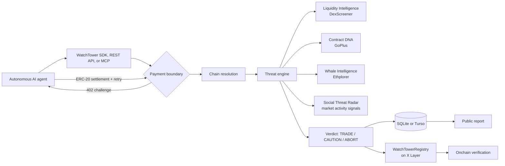
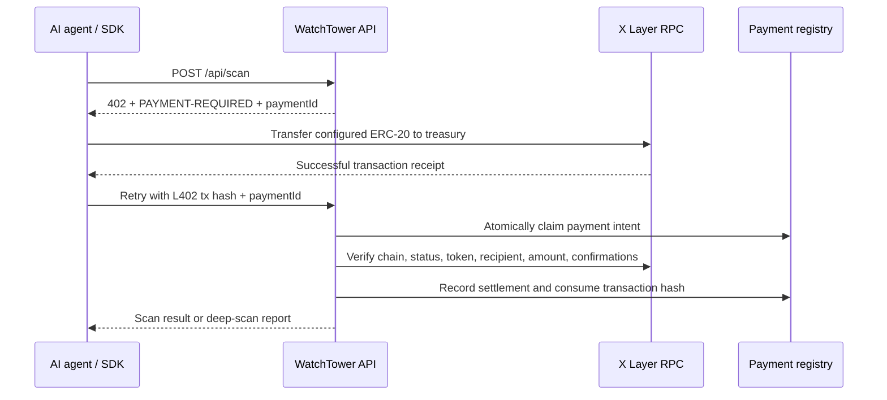

# WatchTower

## The security oracle for autonomous agents that trade onchain

An autonomous trading agent finds a newly launched token, sees momentum, and prepares a buy. The token is a honeypot. Before the trade is signed, WatchTower intercepts the decision, analyzes the contract and market in real time, returns an **ABORT** verdict, and anchors a cryptographic receipt on X Layer.

That is the job: give autonomous agents a security decision they can act on before they put capital at risk.

WatchTower is not another token-scanning dashboard. It is **threat-intelligence middleware** for AI agents: an API, MCP server, and TypeScript SDK that turn live onchain and market signals into a machine-readable `TRADE`, `CAUTION`, or `ABORT` recommendation. Deep-scan results are persisted as public reports and cryptographically attested on X Layer.

> Built for the X Layer Hackathon. WatchTower is engineered for an X Layer Mainnet deployment: network-specific values live in configuration, while the security engine, payment boundary, MCP flow, SDK, and report pipeline remain unchanged across environments.

| In one minute | WatchTower answers |
| --- | --- |
| **The problem** | Autonomous agents can execute faster than humans can spot honeypots, illiquidity, concentrated ownership, and hostile token controls. |
| **The solution** | An agent-callable security layer that scans before execution, bills machine-to-machine, and returns a policy-ready verdict. |
| **Why X Layer** | Low-cost, high-throughput EVM execution makes attestations practical for frequent security decisions, not just occasional audits. |
| **Why it is different** | WatchTower is middleware for agents, with MCP and SDK integration, shared threat intelligence, and verifiable onchain receipts. |

---

## Why this matters

The next wave of onchain activity will not be clicked through manually. AI agents will research markets, rebalance portfolios, discover liquidity, and submit transactions at machine speed. That creates a painful asymmetry: malicious token contracts need only one automated mistake, while every agent needs reliable risk context before each decision.

Traditional scanners are designed for a human reading a web page after the fact. WatchTower is designed for the moment before execution:

1. An agent submits a token address, with an explicit EVM chain or automatic chain resolution.
2. WatchTower evaluates live, verifiable risk signals across liquidity, contract behavior, holder concentration, and market/social activity.
3. The agent receives a compact verdict and reasoning it can place directly in its own execution policy.
4. A deep scan creates a public report and, after confirmation, an immutable X Layer attestation.

The result is a reusable security primitive for every agent builder, rather than a one-off research tool.

---

## Why X Layer

Security decisions for autonomous agents need to be inexpensive enough to make often and fast enough to matter. X Layer is the deliberate foundation for WatchTower's attestation and payment layer.

X Layer is an EVM-compatible Ethereum Layer 2 built by OKX with Polygon CDK technology. Its scalable execution environment and low transaction-cost profile make it well suited to recording high-frequency security receipts that would be uneconomical on a high-fee base layer. Its EVM compatibility also lets WatchTower use familiar ERC-20 payment and Solidity attestation patterns while remaining accessible to existing agent and wallet tooling. [X Layer announcement](https://medium.com/xlayer-official/introducing-x1-a-new-evm-compatible-layer-2-network-designed-to-build-the-future-of-web3-2d9ec69312a6) [Polygon CDK overview](https://docs.polygon.technology/chain-development/cdk/get-started/overview)

For WatchTower, that translates into four practical advantages:

- **Fast confirmation path and cost-effective attestations.** X Layer's low-latency execution environment makes a security receipt practical at the point of an agent decision, without turning the receipt itself into the product's largest cost.
- **EVM-native payments.** Agents settle configured ERC-20 payments and WatchTower verifies the exact token, recipient, amount, chain, and transaction status.
- **A scalable path for machine activity.** The architecture is suited to frequent agent-to-agent requests, rather than a handful of manual approvals.
- **Polygon CDK ecosystem alignment.** WatchTower is built around the same EVM and scalable-chain direction that supports interoperable, ZK-powered L2 infrastructure.

X Layer is not an ornamental deployment target. It makes it feasible for an agent security protocol to leave an inexpensive, independently verifiable audit trail for decisions that happen all day.

---

## What WatchTower does today



### A real-data-only threat engine

WatchTower currently combines four modules:

| Module | Live data source | What it evaluates |
| --- | --- | --- |
| **Liquidity Intelligence** | DexScreener | Liquidity depth, missing pairs, pair age, volume, and inactive markets. |
| **Contract DNA Scanner** | GoPlus Security | Honeypot behavior, sell restrictions, mintability, ownership controls, and token taxes. |
| **Whale Intelligence** | Ethplorer | Holder concentration and largest-holder exposure. |
| **Social Threat Radar** | DexScreener-backed activity signals | Market activity, transaction skew, volatility, and bot-like indicators. LunarCrush is an integration-ready future provider, not an active source today. |

Only genuine, provider-backed results affect the threat score. If a module is unavailable, rate-limited, or cannot verify a result, WatchTower marks it unavailable, excludes its weight from the score, redistributes the remaining weights, and lowers confidence. It never invents, estimates, or simulates risk data to fill a gap.

### Chain-aware by design

The same contract address can exist on multiple EVM networks. WatchTower therefore treats `chainId` as a first-class security input. Callers may supply it explicitly; when omitted, the service uses liquidity, bytecode, and security-profile signals to resolve the most likely supported network. Ambiguous or fallback-only detections are rejected before payment, preventing a paid scan from silently targeting the wrong chain.

### Public reports, deterministic receipts

Deep scans create a report and a deterministic content hash:

```text
sha256(chainId:tokenAddress:threatScore:confidence:timestamp)
```

After the registry transaction has mined successfully, WatchTower stores the transaction hash and exposes the result through the report and verification experiences. The onchain registry emits a chain-aware `ScanRecorded` event containing the token, scan hash, score, and timestamp.

---

## The developer experience: security middleware in a few lines

WatchTower's SDK is its primary product surface. It lets an autonomous agent place a security gate immediately before its own execution logic, without teaching every agent team how to interpret every honeypot signal.

The workspace package is currently named `okx-watchtower-middleware` and is designed for the `@okx-watchtower-middleware` package identity when published. It is intentionally a middleware layer, not just a data endpoint.

```ts
import {
  WatchTowerAbortError,
  WatchTowerClient,
} from "okx-watchtower-middleware";

const watchtower = new WatchTowerClient({
  apiUrl: "https://your-watchtower-host",
  agentWallet: process.env.AGENT_WALLET!,
  threshold: 70,
  paymentPrivateKey: process.env.AGENT_PAYMENT_KEY,
  paymentRpcUrl: process.env.MAINNET_RPC_URL,
  paymentPolicy: {
    apiOrigin: "https://your-watchtower-host",
    chainId: 196,
    tokenAddress: process.env.MAINNET_USDT_ADDRESS!,
    treasuryAddress: process.env.MAINNET_TREASURY_ADDRESS!,
    maxAmount: "1",
  },
});

try {
  const intelligence = await watchtower.guardTransaction(tokenAddress);
  // Continue only when this agent's own execution policy accepts the verdict.
  submitTrade(intelligence);
} catch (error) {
  if (error instanceof WatchTowerAbortError) {
    cancelTrade(error.reasoning);
  }
  throw error;
}
```

When an approved server returns a payment challenge, the SDK validates its pinned payment policy, settles the ERC-20 transfer from the agent runtime, waits for a successful receipt, and retries exactly once with the issued payment intent. A transaction hash is consumed for one request and is not retained for a later scan.

**Important:** `paymentPrivateKey` belongs only in a secure, server-side agent runtime. It must never be embedded in a browser bundle, supplied through a dashboard input, committed to the repository, or shared with a third party.

---

## Machine-to-machine payment flow

WatchTower implements a production-shaped, self-hosted x402-style payment boundary for X Layer. It does not claim to be a hosted facilitator. Instead, it verifies the actual ERC-20 transfer against the configured RPC and keeps the verification and settlement boundary isolated behind `PaymentService` so a standards-compliant facilitator or local verifier can replace it later without touching the scan engine.



### What is verified

Before a protected request proceeds, the verifier checks:

- the transaction was mined successfully;
- it occurred on the configured network and chain ID;
- it interacted with the configured ERC-20 contract;
- an ERC-20 `Transfer` event sent funds to the configured treasury address;
- the received amount meets or exceeds the tier price, using configured token decimals;
- the transaction has the configured confirmation depth; and
- the transaction hash has not already unlocked another request.

Payment intents bind a 402 challenge to its endpoint, tier, and request body. Atomic intent claims and a used-transaction registry prevent replay and concurrent double-spend attempts. Failed deep-scan attestation does not masquerade as success: the intent remains retryable rather than returning a falsely anchored report.

### Current pricing

| Tier | Endpoint | Price | Outcome |
| --- | --- | ---: | --- |
| **Firewall Scan** | `POST /api/scan` | 0.5 USDT | Fast risk verdict for an agent policy. |
| **Deep Scan** | `POST /api/scan/deep` | 1 USDT | Full report plus X Layer attestation after confirmed registry write. |

The production target is **X Layer Mainnet (chain ID 196)**. Network-specific values such as RPC URLs, treasury, token, registry address, and chain IDs live in configuration. Production mode rejects an invalid or missing network selection rather than silently choosing a network.

---

## Architecture and trust model

### Why the engine is offchain in V1

Threat analysis is intentionally offchain today. Calling external intelligence providers, interpreting contract-risk metadata, resolving chains, and aggregating market signals are latency-sensitive tasks that are expensive and impractical to execute inside a smart contract. Keeping that work offchain allows WatchTower to return a useful decision before an agent executes, while storing the important result as a durable onchain receipt.

This is a conscious V1 trade-off, not a hidden claim of full decentralization:

| V1, implemented | Why it is the right starting point |
| --- | --- |
| Central WatchTower threat engine | Fast provider calls, practical operating cost, and rapid iteration on security rules. |
| Self-hosted RPC payment verification | The server independently verifies actual ERC-20 transfers and replay state without trusting a Web2 payment gateway. |
| Owner-operated registry writer | Keeps attestation writes reliable while the protocol and validator economics are still being proven. |
| Public reports and registry events | Makes the result and its onchain timestamp independently inspectable. |

The attestation proves that the configured WatchTower registry recorded a particular scan hash at a given time. It does **not** prove that every offchain provider response was independently recomputed by a decentralized network. Consumers should treat a verdict as threat intelligence and retain their own execution limits, wallet permissions, and risk policy.

### Decentralization roadmap

The next protocol stages are planned work, not features claimed by this repository:

1. **Distributed validator nodes** that independently fetch and score the same evidence.
2. **Decentralized security workers** with staking, reputation, and challenge mechanisms.
3. **Cryptographic evidence commitments** for the exact inputs used by each module.
4. **ZK proofs for defined portions of threat calculation** where proving cost and provider data availability make this practical.
5. **Trust-minimized attestation generation** in which multiple validators authorize a report before it reaches the registry.

The present boundaries are deliberately shaped for that evolution: payment verification, providers, scan orchestration, scoring, persistence, MCP, SDK, and registry interaction are separated rather than fused into route handlers.

---

## Interfaces

### REST API

| Endpoint | Purpose |
| --- | --- |
| `POST /api/scan` | Tier 2 firewall scan. |
| `POST /api/scan/deep` | Tier 1 deep scan and confirmed X Layer attestation. |
| `POST /api/mcp` | Streamable HTTP endpoint for MCP-compatible clients. |
| `GET /api/telemetry` | Paginated operational telemetry. |
| `GET /api/health` | Health and payment-network readiness check. |

Example scan request:

```bash
curl -X POST http://localhost:3000/api/scan \
  -H "Content-Type: application/json" \
  -d '{
    "tokenAddress": "0xYourTokenAddress",
    "agentWallet": "0xYourAgentWallet",
    "chainId": "1952"
  }'
```

The first protected request receives `402 Payment Required` together with `PAYMENT-REQUIRED` and `X-WatchTower-Payment-Id` headers. After settlement, retry the same request with:

```text
Authorization: L402 <x-layer-transaction-hash>
X-WatchTower-Payment-Id: <payment-id-from-the-402-response>
```

Invalid EVM addresses are rejected before provider calls. Unknown or ambiguous chain resolution is returned before a payment challenge. Public endpoints also use durable, fixed-window rate limiting.

### MCP

The MCP server exposes the same scan workflows to desktop and local AI agents through `POST /api/mcp`. The payment and chain-safety boundaries are shared with REST, so MCP cannot bypass validation or settlement rules.

Typical tools:

- `scan_token` for firewall intelligence.
- `deep_scan_token` for an attested deep scan.

### Browser demonstration

The Command Center is a visual demonstration of the agent flow. It can connect to a compatible injected EVM wallet such as MetaMask or OKX Wallet, preflight the configured X Layer Mainnet and balances, request a token transfer, wait for its receipt, and retry the scan. It never asks a user to type a private key.

---

## Quick start

### Prerequisites

- Node.js 20+
- npm
- Foundry, only for smart-contract development and tests
- Access to an X Layer Mainnet RPC, the configured ERC-20 payment token, and native OKB for payment and attestation operations

### Install and run

```bash
git clone https://github.com/demola13777/watchtower.git
cd watchtower
npm install
npm --prefix packages/watchtower-sdk install
npm --prefix packages/watchtower-sdk run build
cp .env.example .env.local
npm run dev
```

Open `http://localhost:3000` for the Command Center, `http://localhost:3000/docs` for in-app developer material, and `http://localhost:3000/verify` to inspect an attestation.

### Configure X Layer Mainnet

Set the active environment and supply the network-specific values in `.env.local`:

```bash
NEXT_PUBLIC_NETWORK_ENV=mainnet

MAINNET_RPC_URL=https://your-dedicated-x-layer-rpc
MAINNET_TREASURY_ADDRESS=0xYourTreasury
MAINNET_USDT_ADDRESS=0xYourAcceptedToken
MAINNET_PAYMENT_TOKEN_DECIMALS=6

NEXT_PUBLIC_REGISTRY_ADDRESS=0xYourRegistry
NEXT_PUBLIC_REGISTRY_CHAIN_ID=196
NEXT_PUBLIC_REGISTRY_RPC_URL=https://your-dedicated-x-layer-rpc
PRIVATE_KEY=0xRegistryWriterKey
```

`MAINNET_PAYMENT_TOKEN_DECIMALS` must match the configured ERC-20. The sample value is appropriate for many USDT/USDC deployments, but the configuration is intentionally token-agnostic.

For an automated agent demo, configure a funded **server-side** agent wallet separately:

```bash
AGENT_PAYMENT_KEY=0xAgentRuntimeKey
```

That wallet needs the configured payment token and enough native X Layer gas token for transfers. Keep all private keys in local or managed secret storage. `.env.local` is ignored by Git and must never be committed.

### Mainnet launch configuration

The business logic has no mainnet-specific branch. A live deployment requires an explicit X Layer Mainnet RPC, verified payment-token contract, treasury, registry address, production database, confirmation policy, and registry signer. Before enabling paid traffic, complete [the mainnet readiness checklist](./docs/MAINNET_READINESS.md) and run end-to-end validation with real funds.

---

## Local quality checks

```bash
# Application lint and production build
npm run lint
npm run build

# SDK package build
npm --prefix packages/watchtower-sdk run build

# Smart-contract tests
cd contracts && forge test -vv

# Payment-boundary smoke test (does not spend funds)
cd .. && npm run test:payments
```

The repository also includes CI for linting, production builds, SDK builds, Foundry tests, and high-severity production dependency audit checks.

---

## Security posture

WatchTower is security infrastructure, so its own boundaries matter:

- Request bodies use strict validation for EVM addresses and supported chain IDs.
- Provider failures are visible and excluded from scoring rather than converted into invented values.
- API and MCP requests share the same payment, validation, chain-resolution, and rate-limit boundaries.
- Payment settlements are checked against the configured chain, token, treasury, amount, transaction success, confirmation depth, and one-time-use registry.
- Payment policy pinning prevents the SDK from automatically paying an arbitrary token, chain, recipient, amount, or API origin.
- Deep-scan reports are only labeled onchain when the registry transaction is confirmed successfully.
- Secrets remain server-side. No private-key entry field exists in the browser experience.

WatchTower is threat intelligence, not a guarantee of safety or a replacement for independent transaction simulation, wallet permissions, position sizing, and operator oversight. Agent builders should use its verdict as one component of a defense-in-depth execution policy.

---

## Project map

```text
src/
  app/api/                 REST, MCP, telemetry, and health routes
  config/network.ts        Network-specific configuration boundary
  lib/engine.ts            Threat modules and deterministic scoring
  lib/payment.ts           Payment intents and payment-service boundary
  lib/scan-service.ts      Shared scan orchestration
  services/paymentVerifier.ts  Self-hosted ERC-20 verification
  lib/db/                  Drizzle schema and database access
packages/
  watchtower-sdk/          TypeScript middleware for agent runtimes
contracts/
  src/WatchTowerRegistry.sol  X Layer attestation registry
  test/                    Foundry coverage for registry ownership and events
demo/                      Agent and MCP integration examples
```

---

## The opportunity

AI agents will become permanent participants in onchain markets. Their security layer should be as programmable as their execution layer, as easy to integrate as middleware, and as accountable as an onchain receipt.

WatchTower is the foundation for that layer: a real-time threat oracle for agents, paid for by agents, and anchored on X Layer.

**Build agents that know when not to trade.**

---

## Links

- Repository: [github.com/demola13777/watchtower](https://github.com/demola13777/watchtower)
- X Layer: [official site](https://www.xlayer.tech/) and [network status](https://status.xlayer.tech/)
- Polygon CDK: [developer overview](https://docs.polygon.technology/chain-development/cdk/get-started/overview)
