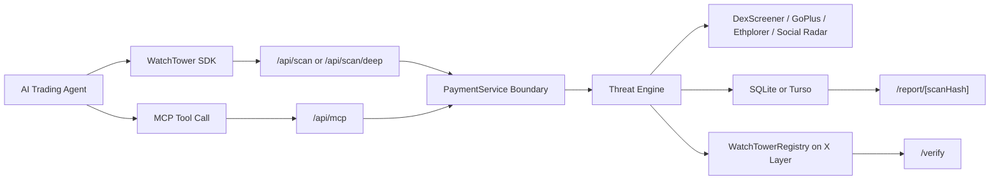

# WatchTower

Threat intelligence middleware for autonomous AI trading agents.

WatchTower lets an agent ask one question before it trades: **is this token safe enough to touch?** It combines token intelligence modules, agent-facing APIs, MCP tooling, x402-style machine payments, and public on-chain attestations so trading agents can block malicious contracts before execution.

This project was built for the OKX AI Hackathon with a production-minded architecture: free-tier data providers and self-hosted payment verification are isolated behind service boundaries so they can be replaced later without rewriting the scan engine, SDK, MCP server, or route logic.

## Why It Exists

Autonomous trading agents can discover and execute opportunities faster than humans can review them. That creates a new failure mode: an agent may interact with a honeypot, illiquid token, concentrated supply, or suspicious market before the operator notices.

WatchTower is designed as an agent-first security layer:

- Agents call WatchTower from their own runtime through the SDK, REST API, or MCP.
- WatchTower returns a machine-readable `TRADE`, `CAUTION`, or `ABORT` recommendation.
- Deep scans generate public reports that can be shared as receipts.
- Scan attestations are recorded on X Layer for independent verification.

WatchTower is not a wallet dashboard and does not require wallet connection for the public web experience.

## What Makes WatchTower Different

WatchTower is a threat-intelligence oracle, not an execution-plan verifier. It does not try to sign or enforce a full transaction policy. Instead, it gives autonomous agents fresh token-risk intelligence at the point of decision.

The core product surface is:

- **SDK middleware** for agent code.
- **MCP tools** for desktop and local AI agents.
- **REST APIs** for direct integrations.
- **x402-style payment challenges** for machine-to-machine access.
- **Public scan reports** and **on-chain attestations** for transparency.

That keeps WatchTower focused: it answers whether a target token is dangerous before an agent commits capital.

## Architecture



Key boundaries:

- `src/lib/payment.ts` centralizes payment validation.
- `src/lib/scan-service.ts` orchestrates shared scan workflows.
- `src/lib/engine.ts` contains the threat-scoring modules and deterministic scan hash.
- `src/lib/chain-resolver.ts` resolves or validates scan `chainId`.
- `src/app/api/mcp` exposes the same scan workflows as MCP tools.
- `packages/watchtower-sdk` provides agent-side integration.
- `contracts/src/WatchTowerRegistry.sol` stores chain-aware scan attestations.

## Core Features

### Agent-First Scan Interfaces

- `POST /api/scan` for fast Tier 2 firewall scans.
- `POST /api/scan/deep` for Tier 1 detailed reports and attestations.
- `POST /api/mcp` for MCP-compatible agents.
- `okx-watchtower-middleware` SDK for TypeScript/Node agents.

### Threat Intelligence Modules

| Module | Current Source | Purpose |
| --- | --- | --- |
| Liquidity Intelligence | DexScreener | Liquidity depth, missing pairs, dead markets, pair age, volume |
| Contract DNA Scanner | GoPlus Security | Honeypots, sell restrictions, mintability, owner-balance controls, taxes |
| Whale Intelligence | Ethplorer | Holder concentration and largest-holder risk |
| Social Threat Radar | DexScreener-backed current mode, LunarCrush-ready architecture | Social presence, transaction skew, volatility, bot-like activity indicators |

### Chain-Aware Scanning

Token addresses are not globally unique across EVM chains. WatchTower accepts `chainId` on REST, SDK, and MCP requests. If omitted, it attempts chain resolution using liquidity, bytecode, and security-profile signals.

Default fallback:

- X Layer Mainnet: `196`
- X Layer Testnet support: `1952`

### x402-Style Payment Boundary

Protected scan routes return `402 Payment Required` with a `PAYMENT-REQUIRED` challenge.

Current pricing:

- Tier 1 Deep Scan: `1 USDT`
- Tier 2 Firewall Scan: `0.5 USDT`

Current mode:

- **Development / self-hosted Web3 verification**
- Agents transfer ERC-20 USDT to the configured treasury.
- The retry request sends `Authorization: L402 <settlement_transaction_hash>`.
- The verifier checks chain id, transaction success, token contract, treasury recipient, amount, confirmation depth, and replay status.

The `PaymentService` interface is intentionally centralized so a production x402 facilitator or LSAT-style cryptographic validator can replace the self-hosted verifier without changing the scan engine or route logic.

### Public Reports and Attestations

Deep scans generate:

- A public report at `/report/[scanHash]`.
- A deterministic hash using:

```text
sha256(chainId:tokenAddress:threatScore:confidence:timestamp)
```

- An X Layer registry event from `WatchTowerRegistry`.
- Verification through `/verify`.

Current X Layer Testnet registry:

- Address: `0x035FE9151000cd4346f4A07f5878474ea6fd21b7`
- Chain ID: `1952`
- Deployment transaction: `0xc2c598922d62814f74d6060c67038be96618a5583b44c53f992a124d9c2eef9e`

## Quick Start

### Requirements

- Node.js 20+
- npm
- Foundry, only if working with contracts
- A configured `.env.local`

### Install

```bash
npm install
cd packages/watchtower-sdk && npm install && npm run build
cd ../..
```

### Configure

```bash
cp .env.example .env.local
```

For local development without paid scans, the app can boot with minimal configuration. For paid scan routes to work, configure the active payment network:

```bash
NEXT_PUBLIC_NETWORK_ENV=testnet
TESTNET_RPC_URL=https://testrpc.xlayer.tech
TESTNET_TREASURY_ADDRESS=0x...
TESTNET_USDT_ADDRESS=0x...
TESTNET_PAYMENT_TOKEN_DECIMALS=6
```

For registry writes:

```bash
PRIVATE_KEY=0x...
NEXT_PUBLIC_REGISTRY_ADDRESS=0x035FE9151000cd4346f4A07f5878474ea6fd21b7
NEXT_PUBLIC_REGISTRY_CHAIN_ID=1952
NEXT_PUBLIC_REGISTRY_RPC_URL=https://testrpc.xlayer.tech
```

Never commit a real private key.

### Run Locally

```bash
npm run dev
```

Open:

- Homepage: `http://localhost:3000`
- Network dashboard: `http://localhost:3000/network`
- Verifier: `http://localhost:3000/verify`
- MCP endpoint: `http://localhost:3000/api/mcp`

## SDK Usage

The SDK is in `packages/watchtower-sdk` and is named `okx-watchtower-middleware`.

```ts
import { WatchTowerClient, WatchTowerAbortError } from "okx-watchtower-middleware";

const wt = new WatchTowerClient({
  apiUrl: "https://watchtower.xyz",
  agentWallet: "0xYourAgentWallet",
  chainId: 196,
  threshold: 70,
  paymentPrivateKey: process.env.AGENT_PAYMENT_KEY,
});

try {
  const intel = await wt.guardTransaction("0xTokenAddress");
  console.log(intel.recommendation, intel.threatScore);
  // Continue only if your agent's own policy accepts the result.
} catch (error) {
  if (error instanceof WatchTowerAbortError) {
    console.log("Trade blocked", error.threatScore, error.reasoning);
  }
}
```

If `paymentPrivateKey` is configured, the SDK automatically handles a `402` challenge by sending the ERC-20 payment transaction and retrying with the settlement hash.

Deep scan:

```ts
const report = await wt.deepScan("0xTokenAddress", { chainId: 196 });
console.log(report.verification.scanHash);
```

## MCP Integration

WatchTower exposes a Streamable HTTP MCP endpoint at:

```text
http://localhost:3000/api/mcp
```

Example MCP config:

```json
{
  "mcpServers": {
    "watchtower": {
      "url": "http://localhost:3000/api/mcp"
    }
  }
}
```

Available tools:

- `scan_token`
- `deep_scan_token`

Inputs:

```json
{
  "tokenAddress": "0x...",
  "chainId": "196",
  "agentWallet": "0x..."
}
```

Paid MCP tool calls use the same payment boundary as REST. Batched paid tool calls are intentionally rejected so one payment challenge maps to one paid scan action.

## REST API Overview

### `POST /api/scan`

Tier 2 firewall scan. Price: `0.5 USDT`.

Request:

```json
{
  "tokenAddress": "0x...",
  "chainId": "196",
  "agentWallet": "0x..."
}
```

Response:

```json
{
  "success": true,
  "data": {
    "tokenAddress": "0x...",
    "chainId": "196",
    "threatScore": 42,
    "confidence": 0.75,
    "recommendation": "CAUTION",
    "reasoning": [],
    "scanHash": "..."
  }
}
```

### `POST /api/scan/deep`

Tier 1 deep scan. Price: `1 USDT`.

Returns a full report with module breakdown, recommendations, public report hash, and registry transaction hash when on-chain submission succeeds.

### `GET /api/telemetry`

Read-only dashboard metrics and latest scan feed.

Query params:

- `page`
- `limit`, capped at `100`

## Demo Workflows

Protected SDK agent:

```bash
node demo/protected-agent.js
```

Deep scan API demo:

```bash
node demo/deep-scan-agent.js
```

MCP demo:

```bash
node demo/mcp-agent.js
```

Payment challenge regression:

```bash
npm run test:payments
```

Set `PAYMENT_TEST_TX_HASH` to validate a real settlement transaction and replay rejection.

## Smart Contract

The registry stores chain-aware scan attestations.

```solidity
event ScanRecorded(
    uint256 indexed chainId,
    address indexed tokenAddress,
    string scanHash,
    uint256 threatScore,
    uint256 timestamp
);
```

Deploy:

```bash
cd contracts
forge script script/DeployWatchTowerRegistry.s.sol:DeployWatchTowerRegistry \
  --rpc-url $TESTNET_RPC_URL \
  --broadcast \
  --slow
```

Test:

```bash
cd contracts
forge test
```

## Database

Local development uses SQLite at `watchtower.db`.

Production should use Turso/libSQL:

```bash
TURSO_DATABASE_URL=libsql://...
TURSO_AUTH_TOKEN=...
npm run db:push
```

The app chooses the database driver automatically:

- `TURSO_DATABASE_URL` set: Turso/libSQL
- not set: local SQLite

## Deployment on Vercel

Required for a public deployment:

- `NEXT_PUBLIC_SITE_URL`
- `TURSO_DATABASE_URL`
- `TURSO_AUTH_TOKEN`
- `PRIVATE_KEY`, only if the deployed server should write attestations
- registry variables:
  - `NEXT_PUBLIC_REGISTRY_ADDRESS`
  - `NEXT_PUBLIC_REGISTRY_CHAIN_ID`
  - `NEXT_PUBLIC_REGISTRY_RPC_URL`
- payment variables for the active network:
  - `NEXT_PUBLIC_NETWORK_ENV`
  - `TESTNET_RPC_URL` or `MAINNET_RPC_URL`
  - treasury address
  - accepted token address
  - token decimals

Recommended production settings:

- `PAYMENT_MIN_CONFIRMATIONS=1` or higher
- `RECORD_FIREWALL_SCANS=false` if gas cost should be limited to deep scans
- paid RPC providers for all production chains
- Turso database instead of local SQLite

The project includes:

- Next metadata
- `robots.ts`
- `sitemap.ts`
- basic security headers
- report loading/error/not-found states

## Verification Commands

```bash
npm run lint
npm run build
cd packages/watchtower-sdk && npm run build
cd ../../contracts && forge test
cd .. && npm run test:payments
```

## Current Limitations

These are known and intentionally documented:

- The payment layer is self-hosted Web3 verification, not a full production x402 facilitator integration yet.
- Public/manual payment by transaction hash remains a convenience path; SDK agents can settle automatically with `paymentPrivateKey`.
- Rate limiting is in-memory and resets across serverless instances. Use Redis, Upstash, or a database-backed limiter for production scale.
- Free-tier intelligence APIs can rate-limit or return incomplete data. The engine lowers confidence when modules are unavailable.
- Social Threat Radar is LunarCrush-ready, but the current free-tier implementation is DexScreener-backed.
- Local SQLite is for development only. Vercel/public deployments should use Turso.
- The server-side registry writer uses `PRIVATE_KEY`; for production, move signing to managed custody, a relayer, or KMS-backed key management.

## Roadmap

- Production x402 facilitator or LSAT-compatible signed payment envelopes.
- Redis/Upstash-backed rate limiting and idempotency controls.
- Paid provider adapters for DexScreener alternatives, GoPlus, Ethplorer, and LunarCrush.
- Stronger request-bound payment proofs for manual web flows.
- Dedicated SDK package publishing workflow.
- Expanded Foundry tests for ownership transfer and event indexing.
- CI pipeline for lint, build, SDK build, payment challenge tests, and Foundry tests.

## Project Structure

```text
watchtower/
  src/app/                  Next.js routes, pages, and API handlers
  src/app/api/scan          Tier 2 firewall endpoint
  src/app/api/scan/deep     Tier 1 deep scan endpoint
  src/app/api/mcp           MCP Streamable HTTP endpoint
  src/lib/engine.ts         Threat intelligence engine
  src/lib/payment.ts        PaymentService boundary
  src/lib/scan-service.ts   Shared scan orchestration
  src/lib/chain-resolver.ts Chain detection and fallback logic
  src/lib/db                Drizzle schema and database connection
  packages/watchtower-sdk   Agent SDK
  contracts/                WatchTowerRegistry and Foundry tests
  demo/                     Agent and API demos
  scripts/                  Regression scripts
```

## License

ISC
